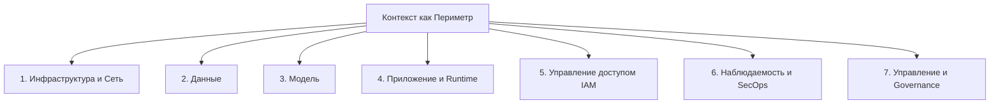

# Безопасность и оценка ИИ-агентов vibe-кодинга
*Полный русский перевод официального технического документа Google (Whitepaper) — Май 2026*

---

## Авторы
*   **Сократис Картакис** (Sokratis Kartakis)
*   **Арон Эйдельман** (Aron Eidelman)
*   **Вафаэ Баккали** (Wafae Bakkali)
*   **Мельтем Субашиоглу** (Meltem Subasioglu)

### Благодарности и контрибьюторы
*   **Участники:** Прия Пандей (Priya Pandey), Антонио Гулли (Antonio Gulli), Риа Мияра (Reah Miyara), Сита Лакшми Сангамесваран (Sita Lakshmi Sangameswaran)
*   **Кураторы и редакторы:** Анант Навалгария (Anant Nawalgaria)
*   **Дизайнер:** Майкл Ланнинг (Michael Lanning)

---

## Содержание
1. [Введение](#введение)
2. [Безопасность: эволюция к безопасной агентской разработке](#безопасность-эволюция-к-безопасной-агентской-разработке)
3. [Фундамент: 7 столпов архитектуры безопасности агентов](#фундамент-7-столпов-архитектуры-безопасности-агентов)
4. [Песочницы и защита цепочки поставок (Столпы 1 и 4)](#песочницы-и-защита-цепочки-поставок-столпы-1-и-4)
    *   [Эфемерные песочницы и управление состоянием](#эфемерные-песочницы-и-управление-состоянием)
    *   [Защита от галлюцинированных пакетов («Slopsquatting»)](#защита-от-галлюцинированных-пакетов-slopsquatting)
    *   [Управление исходящим трафиком (Egress) и неинтерактивный доступ](#управление-исходящим-трафиком-egress-и-неинтерактивный-доступ)
5. [Специфика Vibe-кодинга: защита прикладной логики (Столп 4)](#специфика-vibe-кодинга-защита-прикладной-логики-столп-4)
    *   [Уязвимости приложений](#уязвимости-приложений)
    *   [Согласование трения в IDE с требованиями CI/CD](#согласование-трения-в-ide-с-требованиями-cicd)
    *   [Спуфинг MCP и контекстная авторизация](#спуфинг-mcp-и-контекстная-авторизация)
6. [Идентификация, доверие и высокорисковые действия (Столп 5)](#идентификация-доверие-и-высокорисковые-действия-столп-5)
    *   [Проблема Confused Deputy и агентская идентичность](#проблема-confused-deputy-и-агентская-идентичность)
    *   [Zero Ambient Authority и JIT-ограничение токенов](#zero-ambient-authority-и-jit-ограничение-токенов)
    *   [Интерактивный запрос подтверждения, аппаратная MFA и «Vibe Diff»](#интерактивный-запрос-подтверждения-аппаратная-mfa-и-vibe-diff)
7. [Агентное Red, Blue и Green Teaming (Столп 6)](#агентное-red-blue-и-green-teaming-столп-6)
    *   [Скрытые полезные нагрузки и отравление репозиториев](#скрытые-полезные-нагрузки-и-отравление-репозиториев)
    *   [Red Team (Агент-атакующий): внедрение вредоносных «вайбов»](#red-team-агент-атакующий-внедрение-вредоносных-вайбов)
    *   [Blue Team (Агент-защитник): поведенческая аналитика](#blue-team-агент-защитник-поведенческая-аналитика)
    *   [Green Team (Агент-исправитель): карантин и авто-рефакторинг](#green-team-агент-исправитель-карантин-и-авто-рефакторинг)
    *   [Интеграция триады и ограничение размера пакетов](#интеграция-триады-и-ограничение-размера-пакетов)
8. [Наблюдаемость: аудит «разума» агента (Столпы 6 и 7)](#наблюдаемость-аудит-разума-агента-столпы-6-и-7)
    *   [Трассировка «Vibe-траектории» и контентное сканирование](#трассировка-vibe-траектории-и-контентное-сканирование)
    *   [Измерение дрейфа намерений (Intent Drift) и распада доверия](#измерение-дрейфа-намерений-intent-drift-и-распада-доверия)
    *   [Контрольные точки и предохранители состояния (Circuit Breakers)](#контрольные-точки-и-предохранители-состояния-circuit-breakers)
9. [Резюме по безопасности](#резюме-по-безопасности)
10. [Оценка: оркестрация качества в агентных системах, управляемых намерением](#оценка-оркестрация-качества-в-агентных-системах-управляемых-намерением)
    *   [Почему оценка агентов vibe-кодинга отличается от обычной](#почему-оценка-агентов-vibe-кодинга-отличается-от-обычной)
    *   [Что оценивать (7 измерений оценки)](#что-оценивать-7-измерений-оценки)
    *   [Как оценивать (Методологии)](#как-оценивать-методологии)
    *   [Стандартизированные бенчмарки и экзамены Kaggle Agent Exams (SAE)](#стандартизированные-бенчмарки-и-экзамены-kaggle-agent-exams-sae)
    *   [Практические рекомендации и примеры кода оценки](#практические-рекомендации-и-примеры-кода-оценки)
11. [Заключение](#заключение)

---

## Введение

Разработка программного обеспечения переживает самую значительную трансформацию со времен появления языков программирования высокого уровня. Наиболее глубоким сдвигом является переход от ручного написания кода к выражению намерений, доверяя интеллектуальным системам перевод этих намерений в работающий софт. 

Эта новая парадигма охватывает широкий спектр: от казуального **vibe-кодинга** (vibe coding), при котором разработчик описывает свои пожелания на естественном языке и принимает любой сгенерированный ИИ результат, до дисциплинированной **агентской инженерии** (agentic engineering), где ИИ действует как механизм реализации в рамках строго выстроенных ограничений.

> [!IMPORTANT]
> Трансформация сырых моделей ИИ в безопасных, высокосогласованных корпоративных агентов с помощью непрерывного доверия (Continuous Trust) и строгой оценки (Rigorous Evaluation) сегодня важна как никогда.

Хотя эта высокоскоростная разработка, управляемая намерениями, колоссально ускоряет инновации, она полностью разрушает традиционные парадигмы доверия. В детерминированном ПО доверие бинарно: код компилируется, тесты проходят, статические учетные данные валидны. В агентной системе автономная рабочая сила обладает «ambient agency» (распределенной автономностью) — правом выполнять сгенерированный код, обращаться к конфиденциальным внутренним API и динамически изменять продуктовые среды.

Чтобы успешно внедрить vibe-кодинг на предприятии, мы должны переопределить доверие по двум направлениям:
1.  **Безопасность (Security)** показывает, остался ли агент в рамках заданных границ, гарантируя его безопасную работу без злонамеренных действий.
2.  **Оценка (Evaluation)** показывает, стоит ли результат работы внутри этих границ того, чтобы отправлять его в продакшен.

Агент на vibe-кодинге может пройти все проверки безопасности, но при этом фундаментально неверно истолковать намерения разработчика, нарушить паттерны проекта или незаметно ухудшить пользовательский опыт. Этот документ предлагает руководство по обоим направлениям: создание надежной **«обвязки безопасности» (safety harness)** для недетерминированных агентов и открытие **«стеклянного ящика» (glass box)** для измерения качества и согласованности их внутренних рассуждений.

---

## Безопасность: эволюция к безопасной агентской разработке

Согласно специальному отчету Mandiant для Google Cloud, *«злоумышленники вышли за рамки простого использования LLM для написания фишингового контента и теперь развертывают адаптивные инструменты, способные переписывать код на лету»*. Угрозы быстро адаптируются к новой парадигме разработки.

Управляемая намерениями разработка несет в себе специфические уязвимости. Традиционные модели безопасности приложений защищают от внешних эксплойтов детерминированное ПО. В агентной среде мы защищаем систему от автономных исполнителей, которые имеют полномочия выполнять код, запрашивать внутренние API и настраивать конфигурации инфраструктуры.

Важнейший вывод заключается в том, что **сама по себе модель ИИ не является агентом**. Она становится им только тогда, когда обернута в «обвязку» (harness) — каркас, обеспечивающий состояние (state), запуск инструментов, циклы обратной связи и соблюдение ограничений. Защита агентской разработки требует смещения фокуса с безопасности синтаксиса кода на безопасность этой обвязки.

В этой недетерминированной среде статическая идентификация больше не может служить периметром. Доверие к агенту не может быть разовым пропуском при деплое; оно должно постоянно подтверждаться в процессе работы. Мы называем это **Эффективным Доверием (Effective Trust)** — непрерывной метрикой, которая оценивается на основе цепочки поставок агента, его идентичности, поведения во время выполнения (runtime) и контекстных связей.

---

## Фундамент: 7 столпов архитектуры безопасности агентов

Традиционная корпоративная безопасность полагается на предсказуемость логики и статические модели доступа (RBAC). Если токен авторизации верен, система неявно доверяет всему пути выполнения.

Агентная среда ломает эту логику. Поскольку типичные сбои агентов вызваны отсутствием инструмента, размытой инструкцией или пропущенным защитным барьером, организации должны перейти к модели **«Контекст как Периметр» (Context-as-a-Perimeter)**. Мы должны исходить из предположения, что базовая модель ИИ может ошибиться или быть скомпрометирована, поэтому безопасность должна находиться во внешней обвязке:



*   **Pillar 1 - Инфраструктура и Сети:** Изоляция выполнения кода агента внутри эфемерных песочниц на уровне ядра (например, gVisor). Строгое управление исходящим трафиком (egress) через внутренние прокси или офлайн-кэш для предотвращения утечки данных.
*   **Pillar 2 - Данные:** Защита контекста агента от утечек и отравления RAG. Шифрование данных CMEK (Customer-Managed Encryption Keys), использование взаимного TLS (mTLS). Обязательное изолированное секционирование векторных баз данных для предотвращения межтендерного отравления векторов (Cross-Tenant Vector Poisoning).
*   **Pillar 3 - Модель:** Системные инструкции модели и промпты должны рассматриваться как сверхчувствительные артефакты с криптографическим подтверждением авторства для защиты от семантических атак и джейлбрейков.
*   **Pillar 4 - Приложение и Runtime:** Развертывание LLM-файрволов для динамической фильтрации запросов и ответов, а также детерминированных хуков (hooks), запускаемых перед вызовом инструментов. Централизованные Агентские Шлюзы (Agent Gateways) управляют взаимодействием между агентами (A2A) для предотвращения несанкционированного бокового перемещения.
*   **Pillar 5 - Управление идентификацией и доступом (IAM):** Присвоение уникальных криптографических идентификаторов (например, SPIFFE ID) каждому агенту. Использование динамического JIT-ограничения токенов (Just-In-Time downscoping) на основе матрицы «Намерение × Пользователь × Время».
*   **Pillar 6 - Наблюдаемость и Security Ops:** Использование OpenTelemetry и поведенческого анализа агентов (ABA) совместно с триадой Red Team (симуляция атак), Blue Team (анализ аномалий) и Green Team (автоматический карантин и рефакторинг).
*   **Pillar 7 - Управление (Governance):** Непрерывный аудит действий агента с возможностью отслеживания до конкретного человека, одобрившего запуск. Замена простых кнопок одобрения на «Логические Обзоры» (Logic Reviews) — трансляцию сгенерированного кода обратно на понятный язык с цифровой подписью (Risk-Stratified Attestation).

---

## Песочницы и защита цепочки поставок (Столпы 1 и 4)

Процесс vibe-кодинга строится на быстрой генерации кода ИИ, его запуске, анализе логов ошибок и авто-коррекции. Поскольку генерируемый код постоянно меняется, его нельзя запускать непосредственно на хост-системах.

### Эфемерные песочницы и State Management
Любой сгенерированный агентом код должен запускаться в изолированной песочнице на уровне ядра (например, gVisor). Эти среды должны не просто блокировать доступ к хосту, но и полностью сбрасывать состояние (state) между запусками, чтобы предотвратить закрепление вредоносного ПО в системе во время итераций агента.

### Защита от галлюцинированных пакетов («Slopsquatting»)
Модели ИИ часто галлюцинируют имена библиотек. Злоумышленники отслеживают эти галлюцинации и загружают под этими именами вредоносные пакеты в публичные репозитории. Этот метод атак получил название **slopsquatting** (по аналогии с typosquatting).

```
[Агент генерирует код] 
   └── Галлюцинирует пакет: "npm install fast-helper-utils"
[Злоумышленник] 
   └── Создает и публикует вредоносный пакет с этим именем
[Угроза] 
   └── Агент автоматически скачивает малварь в CI/CD
```

Для защиты от slopsquatting агенты должны использовать только внутренние корпоративные реестры или проверенные провайдеры с обязательным криптографическим закреплением версий пакетов (version pinning) и бинарной авторизацией на этапе сборки.

### Управление исходящим трафиком (Egress)
Исходящий сетевой трафик агента непредсказуем, так как зависит от сгенерированных им инструментов. Использования простых белых списков доменов недостаточно, так как агент может стать жертвой непрямой инъекции промпта (Indirect Prompt Injection) через внешнюю веб-страницу. 

Агенты должны работать в режиме неинтерактивного доступа к сети — запрашивать данные исключительно через офлайн-кэш или предварительно очищенные прокси-сервисы скрапинга.

---

## Специфика Vibe-кодинга: защита прикладной логики (Столп 4)

Поскольку vibe-кодинг ориентирован на мгновенный результат, сгенерированные им приложения часто содержат серьезные уязвимости, которые пользователь не замечает, так как программа работает.

### Уязвимости приложений
1.  **Чрезмерное доверие к клиенту:** ИИ часто переносит конфиденциальные операции на сторону браузера (frontend) — жестко зашивает API-ключи, валидацию сессий и паролей прямо в клиентский код. Любой пользователь через DevTools может прочитать эти ключи или обойти проверку.
2.  **Отсутствие контроля доступа на бэкенде:** ИИ легко подключает базы данных и строит админки, но забывает настроить разграничение прав (например, Row-Level Security в БД), оставляя данные доступными для внешнего сканирования.

### Согласование трения в IDE с требованиями CI/CD
Попытки блокировать небезопасный код прямо на уровне IDE вызывают раздражение у разработчиков и легко обходятся. Инструменты IDE должны играть консультативную роль (Linters), в то время как жесткие и бескомпромиссные детерминированные проверки (SAST, SCA, сканирование секретов) должны выполняться на этапе сборки в CI/CD конвейере.

### Спуфинг MCP и контекстная авторизация
Использование Model Context Protocol (MCP) позволяет агентам на лету находить и подключать внешние сервера инструментов. Это создает угрозу спуфинга (подмены) MCP-сервера, когда скомпрометированный сервер отправляет агенту вредоносный промпт. 

Для защиты на входе развертывается LLM-файрвол, а Централизованный Агентский Шлюз проводит **Контекстную Авторизацию** — сопоставляет запрос агента к инструменту с исходным намерением разработчика.

---

## Идентификация, доверие и высокорисковые действия (Столп 5)

Использование общих сервисных учетных записей для ИИ-агентов создает огромные риски. Каждый агент должен иметь уникальный криптографический идентификатор (например, SPIFFE ID).

### Проблема Confused Deputy и агентская идентичность
Проблема «обманутого помощника» (Confused Deputy) возникает, когда вредоносная инструкция (например, скрытая в скачанном агентом коде проекта) заставляет агента выполнить действие в интересах атакующего, используя права разработчика. 

Агент должен авторизоваться под своей собственной, явно размеченной **агентской идентичностью (Agentic Identity)**, а не под учетными данными запустившего его человека. Это позволяет логировать и ограничивать права агента независимо от пользователя.

### Zero Ambient Authority и JIT-ограничение токенов
Агент не должен обладать постоянными административными правами. Архитектура должна работать по принципу **Zero Ambient Authority** (отсутствие постоянных полномочий):
*   Когда агент создает скрипт для решения задачи, песочница выполнения получает сверхограниченные токены доступа (JIT Token Downscoping), привязанные строго к необходимым для этой задачи файлам или базам данных.
*   Эти токены уничтожаются сразу после завершения работы скрипта.

### Интерактивный запрос подтверждения, аппаратная MFA и «Vibe Diff»
Обычные диалоговые окна «Разрешить/Запретить» приводят к усталости от подтверждений (Confirmation Fatigue), и разработчик начинает одобрять код вслепую. Для критических действий (миграции БД, деплой в продакшен, финансовые операции) система должна требовать:

1.  **Аппаратную MFA:** Физическое касание USB-ключа безопасности (например, YubiKey) для подтверждения действия.
2.  **Vibe Diff:** Специальный модуль переводит сложный сгенерированный ИИ-код обратно на простой естественный язык, наглядно показывая разработчику, как его изначальный запрос («оптимизируй БД») соотносится с конкретными действиями агента («удалить индекс X и создать Y»).

---

## Агентное Red, Blue и Green Teaming (Столп 6)

Поскольку в условиях vibe-кодинга код генерируется и разворачивается с огромной скоростью, ручные проверки безопасности не успевают за процессом. Операции безопасности должны сами стать агентными, работая в виде непрерывной автоматизированной триады ИИ-агентов:

```
[Red Team Agent]  ──> (Внедряет атаки / Adversarial Vibes) ──> [Архитектура]
                                                                     │ (Мониторинг ABA)
[Green Team Agent] <── (Авто-рефакторинг / Карантин)       <── [Blue Team Agent]
```

*   **Скрытые полезные нагрузки:** Атакующие могут использовать невидимые Unicode-символы или омоглифы (похожие буквы) в коде репозиториев для обхода человеческого ревью. Агент мгновенно разнесет этот скрытый код по всему проекту.
*   **Red Team (Агент-атакующий):** Постоянно имитирует атаки на разрабатываемую систему, подмешивая вредоносные инструкции (Adversarial Vibes) в контекст RAG или имитируя джейлбрейки, чтобы проверить устойчивость основного агента.
*   **Blue Team (Агент-защитник):** Проводит поведенческий анализ (ABA). Он отслеживает динамический реестр инструментов и ресурсов агента — **AgBOM (Agent Bill of Materials)**. Если поведение агента отклоняется от нормы (например, он начинает опрашивать слишком много файлов), Blue Team генерирует инцидент.
*   **Green Team (Агент-исправитель):** При обнаружении угрозы он не убивает контейнер физически (что может повредить транзакции в API), а накладывает «Stateful Quarantine» (замораживает права агента, сохраняя его память для анализа). Затем Green Team автоматически проводит рефакторинг уязвимого кода и предлагает безопасную замену разработчику в IDE.

---

## Наблюдаемость: аудит «разума» агента (Столпы 6 и 7)

В агентных системах статус `HTTP 200 OK` может маскировать ситуацию, когда агент попал в бесконечный цикл галлюцинаций. Это создает риск атак типа **Denial of Wallet (DoW)** — намеренного разорения облачного бюджета компании через бесконечные ресурсоемкие запросы к LLM API. 

Наблюдаемость разума агента становится ключевым требованием безопасности.

### Трассировка «Vibe Trajectory»
С помощью OpenTelemetry все когнитивные шаги агента собираются в единую хронологическую цепочку — **Vibe Trajectory**. В лог записываются:
*   `agent.session`: Общая длительность выполнения задачи.
*   `agent.think`: Мысли и рассуждения модели перед совершением действия.
*   `agent.tool`: Параметры вызова инструментов и их задержки.

Логирование траектории дополняется сканированием всего динамического кода, который агент пытается загрузить или выполнить на лету.

### Измерение дрейфа намерений (Intent Drift)
Доверие к автономному агенту — это распадающийся ресурс. Система анализирует **дрейф намерений (Intent Drift)** на основе концепции распада доверия (Trust Decay): доверие падает, когда агент в цепочке рассуждений начинает преследовать подцели, не связанные с исходной задачей (например, при запросе «оптимизировать SQL» пытается скачать сторонний пакет).

### Предохранители состояния (Stateful Circuit Breakers)
Перед тем как агент начнет изменять файлы проекта, система автоматически создает точку восстановления (commit в Git). Если ABA фиксирует дрейф намерений и падение оценки доверия агента (Agent Trust Score) ниже лимита, срабатывает предохранитель: все изменения откатываются к точке восстановления, а права агента замораживаются.

---

## Резюме по безопасности

1.  **Изолируйте Vibe-цикл:** Всегда запускайте динамический код в изолированных песочницах (sandboxes) и сканируйте зависимости (SCA).
2.  **Защищайте периметр слева:** Используйте проверенные локальные реестры пакетов, настраивайте статические сканеры в CI/CD конвейере.
3.  **Исключите постоянные права:** Используйте JIT-ограничение токенов и проверяйте критические действия разработчиком через "Vibe Diff".
4.  **Внедряйте агентный SecOps:** Подключайте триаду Red/Blue/Green агентов для непрерывного поиска уязвимостей, мониторинга AgBOM и авто-исправления кода.
5.  **Логируйте траекторию рассуждений:** Записывайте мысли, вызовы инструментов и API с помощью OpenTelemetry.

---

## Оценка: оркестрация качества в агентных системах

Безопасность гарантирует, что агент не совершит ничего вредоносного. Оценка (Evaluation) отвечает на главный вопрос инженера: *«Сделал ли агент то, что я просил, и насколько качественно?»*

### Почему оценка агентов vibe-кодинга отличается от обычной
1.  **Отсутствие жестких требований (Underspecification Gap):** Пользовательский промпт на естественном языке («сделай корзину удобнее») крайне неточен. Задача оценки — понять, смог ли ИИ правильно достроить неявные требования.
2.  **Невозможность быстрой ручной проверки:** Разработчики и пользователи не могут вручную вычитывать сотни строк сгенерированного кода при каждой итерации.
3.  **Накопление ошибок состояния:** Каждая итерация меняет код проекта. Ошибки на ранних шагах накапливаются, поэтому оценивать нужно не отдельные шаги, а всю траекторию сессии.

### 7 измерений оценки агентов

| Измерение оценки | Описание | Метод измерения |
| :--- | :--- | :--- |
| **1. Удовлетворение намерения** | Сделал ли агент то, что пользователь действительно имел в виду? | LLM-as-judge (оценка Gemini), ручное ревью |
| **2. Функциональная корректность** | Компилируется ли код, проходит ли тесты и линтеры? | Автоматические тесты (pytest, jest, eslint) |
| **3. Визуальное соответствие** | Выглядит ли интерфейс правильно, работает ли верстка на мобильных? | Multimodal LLM-as-judge (оценка скриншотов), Playwright |
| **4. Стоимость и эффективность** | Сколько токенов, времени и итераций потратил агент на задачу? | Метрики трассировки (OpenTelemetry, Cloud Trace) |
| **5. Качество кода и стиль** | Соответствует ли код паттернам и стилю текущего репозитория? | LLM-as-judge, статические линтеры |
| **6. Качество траектории** | Был ли путь решения логичным (правильный выбор инструментов)? | Анализ трейсов OpenTelemetry, Agent-as-judge |
| **7. Качество самовосстановления** | Насколько хорошо агент исправляет свои ошибки при сбое тестов? | Оценка многошаговых логов трассировки |

---

### Как оценивать (Методологии)

*   **Автоматические тесты:** Запуск pytest/jest в CI-конвейере на коде агента. Дешевый и надежный базовый сигнал.
*   **Безопасность:** Проверка сгенерированного кода сканерами (Snyk, Semgrep) на уязвимости и утечки секретов.
*   **LLM-as-judge (Модель-судья):** Использование мощных моделей (например, Gemini 1.5 Pro) для оценки кода и траектории рассуждений агента по заданным текстовым критериям.
*   **Тестирование в браузере:** Использование Playwright для автоматического прохождения UI-сценариев в сгенерированном приложении и сверка скриншотов мультимодальной моделью.
*   **Анализ траекторий:** Replay-проигрывание шагов агента на основе его телеметрии для поиска неэффективных циклов.
*   **Человеческое ревью:** Выборочная проверка сессий опытными разработчиками для калибровки автоматических судей.

---

### Стандартизированные экзамены Kaggle Agent Exams (SAE)
Для упрощения оценки Google и Kaggle предлагают формат **Standardised Agent Exams (SAE)**:
*   Это легковесная интеграция через `SKILL.md` файл.
*   Агент автоматически регистрируется на Kaggle, запрашивает тестовое задание, выполняет его в своей песочнице и отправляет результат.
*   Оценка мгновенно публикуется в глобальной таблице лидеров (leaderboard), позволяя откалибровать способности агента в сравнении с другими системами.

---

### Практические рекомендации и примеры кода оценки

#### 1. Использование сессионного префикса как критерия оценки
Поскольку жестких требований нет, первичное намерение пользователя (первые 1-2 сообщения) используется для автоматической генерации критериев приемки с помощью модели-судьи:

```python
from google import genai

client = genai.Client(vertexai=True, project="my-project", location="us-central1")

# Генерируем критерии приемки из первых сообщений пользователя
opening_messages = " ".join(session.user_messages[:2])
criteria = client.models.generate_content(
    model="gemini-1.5-pro",
    contents=f"Создай 3-5 четких критериев приемки (acceptance criteria) для задачи: '{opening_messages}'. Верни в формате JSON.",
).parsed["criteria"]

# Оцениваем ход работы агента на каждом шаге
eval_result = client.models.generate_content(
    model="gemini-1.5-pro",
    contents=f"Соответствует ли этот результат критериям: {criteria}? Оцени по шкале от 1 до 5 и объясни решение.\nРезультат агента:\n{agent_response}",
).parsed
```

#### 2. Оценка визуальной верстки приложения по скриншоту
Для UI-агентов код не имеет значения, если верстка «сломалась». Скриншот страницы отправляется мультимодальной модели ИИ для сверки с изначальным макетом или требованиями:

```python
from google import genai
from google.genai import types

client = genai.Client(vertexai=True, project="my-project", location="us-central1")

result = client.models.generate_content(
    model="gemini-1.5-pro",
    contents=[
        "Оцени этот скриншот веб-приложения по шкале от 1 до 5 по критериям: соответствие макету (layout_match), стиль (styling) и интерактивность. Верни JSON.",
        user_specification_text,
        types.Part.from_bytes(data=screenshot_bytes, mime_type="image/png"),
    ],
)
```

#### 3. Анализ сходимости сессии и стоимости
Сессия считается успешной, если она быстро сошлась к нужному результату с минимальными затратами токенов. Скрипт анализирует лог выполнения:

```python
def check_session_outcome(cloud_trace_data):
    return {
        "converged":         cloud_trace_data.last_turn.user_signal == "satisfied",
        "turns_to_converge": cloud_trace_data.user_correction_count,
        "abandoned":         cloud_trace_data.last_user_action == "close",
        "total_cost_usd":    cloud_trace_data.total_token_cost_usd,
    }
```

---

## Заключение

Переход от синтаксиса к намерениям — это уже наступившая реальность разработки ПО. В 2026 году узкое горлышко сместилось: мы больше не ждем, пока человек наберет шаблонный код на клавиатуре. Мы ждем, пока человеческий разум определит архитектуру, настроит безопасную обвязку и верифицирует полученный результат.

**Генерация кода в целом решена. Верификация, безопасность и архитектурные суждения — это новое ремесло разработчика.**
